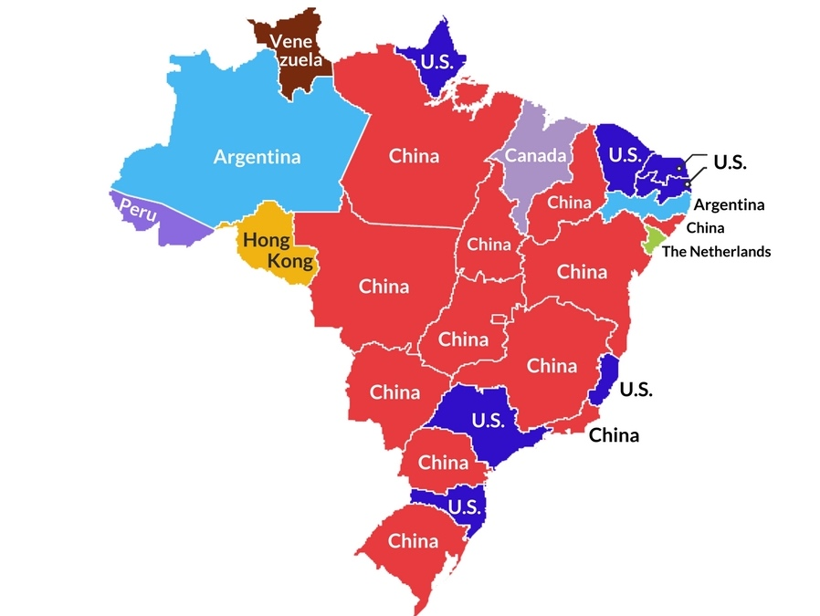
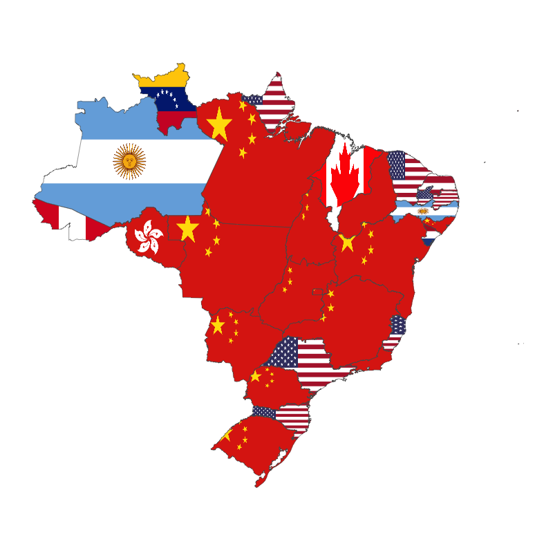
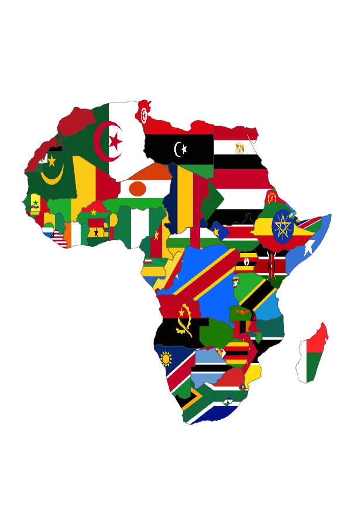
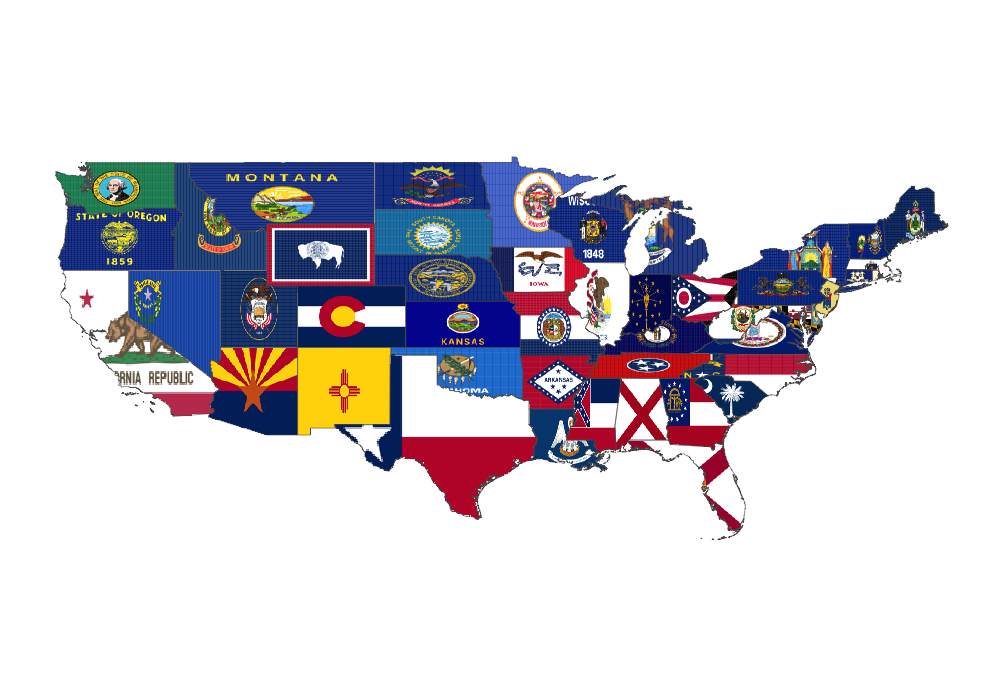
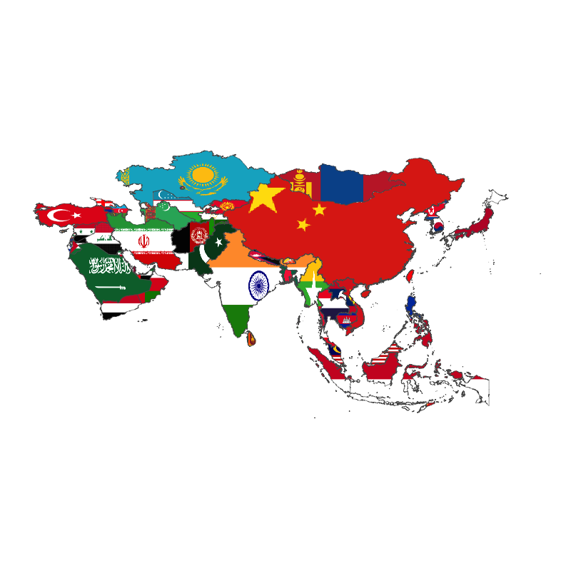
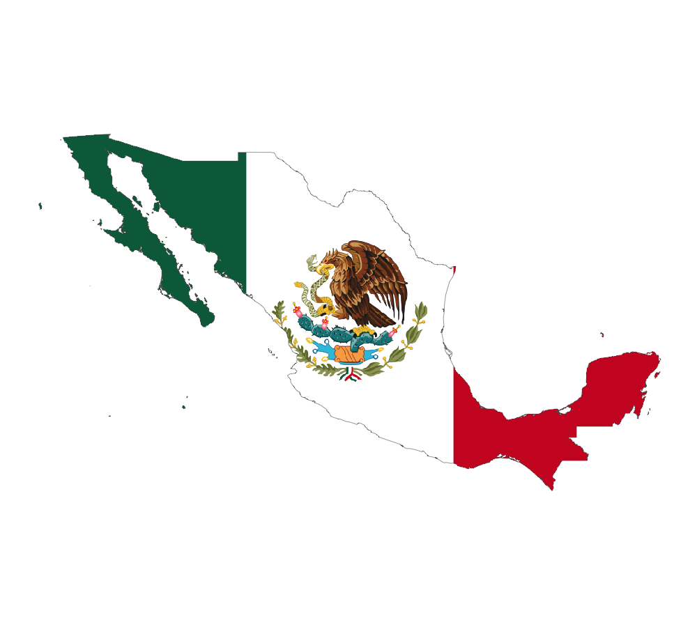

<!-- README.md is generated from README.Rmd. Please edit that file -->

```{r, echo = FALSE}
knitr::opts_chunk$set(
  collapse = TRUE,
  comment = "#>",
  fig.path = "README-"
)
```

# flagfillr {work in progress}

flagfillr is a little package for R that makes it easier to use flags as fills (i.e. backgrounds) for [ggplot2](https://github.com/tidyverse/ggplot2) maps. **Currently not working!! Will be fixed soon.** 

## Installation

You can install flagfillr from github with:

```{r gh-installation, eval = FALSE}
# install.packages("devtools")
devtools::install_github("RobertMyles/flag_fillr")
```

It's not on CRAN because it depends on development versions of some packages. 

<br>

**Important Note:** flagfillr works with ggplot2's `geom_sf()`, which is currently only available in the current development version of ggplot2 (version 2.2.1.9000).  

## Why? For the love of god, why??!!!

Well, I'm happy you asked. Imagine you saw the following image, from the [Drunkneysian](http://drunkeynesian.blogspot.com.br/), taken from [here](https://brazilian.report/2017/11/27/brazil-important-trading-partners/):



It's an interesting subject, and a handy visual summary of the data. But...

<br>

...isn't this sooo much nicer?



(The section below shows how to make it.) Ok...it depends on some knowledge of flags, but look! They're so purty. And, I mean, just look at Africa...



That's pure unadulterated awesome-sauce, right there. (I know, I know. It's not *data* visualization in the case of the Africa plot. But still...) I would argue that it's easier to process the flag map in the above Brazilian case, especially for well-known flags. Anyway, I'm not slighting the Drunkneysian plot, very nice as it is. `flagfillr` merely offers a pretty alternative, and we all like pretty things in our lives, now don't we?  

### Using flagfillr 

You can use `flagfillr` in two ways: you can supply your own data, and use the function `flag_fillr_data()` to make some maps, or you can make pretty pictures with `flag_fillr_country()`, `flag_fillr_continent()` and `flag_fillr_state()`.  

So with the latter option, you can do this:  
```{r, eval = FALSE}
flag_fillr_states("United States of America")
```


And this: 
```{r, eval = FALSE}
flag_fillr_continent("Asia")
```



And even this (¡Viva México!): 

```{r, eval = FALSE}
flag_fillr_country("Mexico")
```

 


**Be aware**: some of these can take some time to plot, especially at higher resolutions and larger sizes.

Ok. The main reason I made this package is to use it with data, even though those 'picture' maps are totes awesome. To recreate something like the Brazilian economic-partners map above, you'll be using the `flag_fillr_data()` function, and you'll need the following: 

- a data.frame with a column for the base territory (where we'll map) and a column for the partners (the flags we'll put there). The simplest case is to just call these columns `country` (if you're plotting flags on entire countries) and `partner`. If you want to plot flags on states inside a country (like the Brazil example above), supply a `state` column. The `country` column is then optional. Note that the name of the country is always necessary, either supplied through `country` or `country_col`. 
- if you have data that you'd rather not rename, you can supply the 'partner' and 'country'/'state' columns, using `partner_col`, `country_col` and `state_col`.  Here's how I made that map above (the code is long 'cos Brazil has lots of states...): 

```{r, eval = FALSE}
library(flagfillr)
library(rnaturalearth)
library(dplyr)
library(stringi)

br <- ne_states(country = "Brazil", returnclass = "sf")
trade <- tibble(
  country = "Brazil",
  state = br$name,
  partner = NA_character_) %>% 
  mutate(state = stri_trans_general(state, "Latin-ASCII"),
         partner = case_when(
          state == "Acre" ~ "Peru",
          state == "Alagoas" ~ "China",
          state == "Amapa" ~ "United States of America",
          state == "Amazonas" ~ "Argentina",
          state == "Bahia" ~ "China",
          state == "Ceara" ~ "United States of America",
          state == "Distrito Federal" ~ "China",
          state == "Espirito Santo" ~ "United States of America",
          state == "Goias" ~ "China",
          state == "Maranhao" ~ "Canada",
          state == "Mato Grosso" ~ "China",
          state == "Mato Grosso do Sul" ~ "China",
          state == "Minas Gerais" ~ "China",
          state == "Para" ~ "China",
          state == "Paraiba" ~ "United States of America",
          state == "Parana" ~ "China",
          state == "Pernambuco" ~ "Argentina",
          state == "Piaui" ~ "China",
          state == "Rio de Janeiro" ~ "China",
          state == "Rio Grande do Norte" ~ "United States of America",
          state == "Rio Grande do Sul" ~ "China",
          state == "Rondonia" ~ "Hong Kong",
          state == "Roraima" ~ "Venezuela",
          state == "Santa Catarina" ~ "United States of America",
          state == "Sao Paulo" ~ "United States of America",
          state == "Sergipe" ~ "Netherlands",
          TRUE ~ "China"
          ))

flag_fillr_data(trade, country = "Brazil", partner_col = trade$partner, 
                state_col = trade$state, type = "state", 
                resolution = "large", size = "250")
```


Don't be put off by all those `state ==`s, remember, you'll be supplying your own data. Here. I had to make it. 

<br>

So there you go! In the (un)likely event you find yourself pining for flags in a ggplot2 map, `flagfillr` has got you covered.

<br>
 

### Contributions 

Pull requests and issues are welcome. I particularly welcome any datasets of flags in png format! 
The plotting of state-level flags is still a bit messy, and removing islands and far-off territories could be much better. The flags are great, though (Argentina has some good ones). 

## Related 

I should mention that this isn't new: Paul Murrel shows how to do it with grid graphics [here](https://journal.r-project.org/archive/2011-1/RJournal_2011-1_Murrell.pdf). And yes, ggplot2 is based on grid graphics. But I haven't seen a ggplot2 one, so... 
For images other than flags in plots other than maps, Giora Simchoni's [ggwithimages](http://giorasimchoni.com/2018/01/03/2018-01-03-congratulations-it-s-a-geom/) package might be what you're looking for.

## Thanks

The main data wrangling function in this package is not painfully slow because the talented [Daniel Falbel](https://github.com/dfalbel) helped me out with purrr's map2. And I don't have [distastrous 'outliers'](https://stackoverflow.com/questions/48366952/check-if-sf-geometry-is-contiguous-in-r) (get it?) because of the help of the gifted [Julio Trecenti](https://github.com/jtrecenti). Valeu, gente!

Giora's package also reminded me of this project (I tried and failed about two years ago), so thanks Giora! And his blog post led me to [this](https://stackoverflow.com/questions/28206611/adding-custom-image-to-geom-polygon-fill-in-ggplot) wonderful SO answer, which set me on my way. Thank you, jalapic and inscaven (I know those are not your real names).  


## Flags
The flags used in this repo come from Wikipedia. The US state flags come from [Civil Services](https://github.com/CivilServiceUSA/us-states). Thanks to Wikipedia and the contributors of the above-linked projects for their work on making these flags available and easy to get!

## to do

- create more repos of state flag pngs   
- clean up method of removing outliers  
- different projections  
